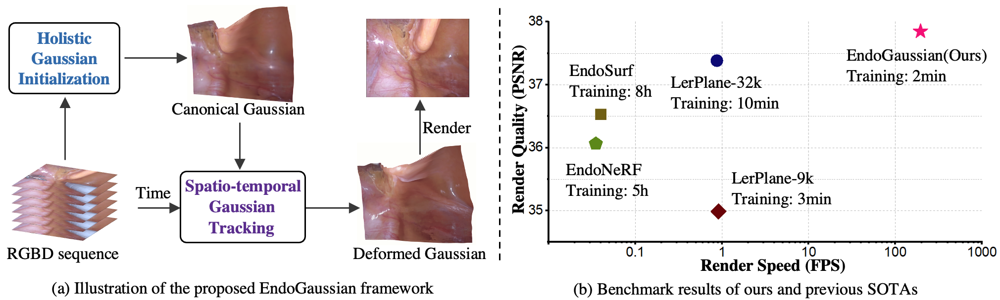
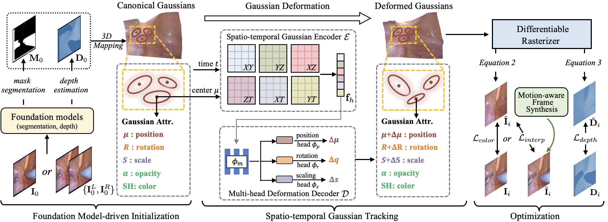
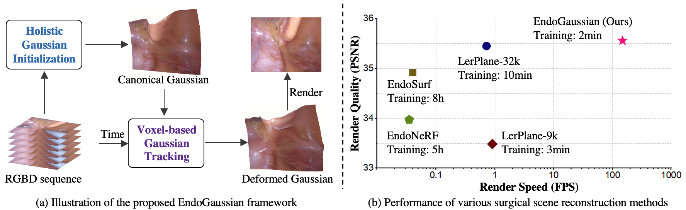

# Offical Code Implementation for EndoGaussian

### [Project Page](https://yifliu3.github.io/EndoGaussian/) | [arXiv Paper](http://arxiv.org/abs/2401.12561) | [TMI Paper](https://ieeexplore.ieee.org/document/10902412)


### [arXiv](http://arxiv.org/abs/2401.12561)

> [EndoGaussian: Real-time Gaussian Splatting for Dynamic Endoscopic Scene Reconstruction](http://arxiv.org/abs/2401.12561) \
> [Yifan Liu](https://yifliu3.github.io/)<sup>*</sup> [Chenxin Li](https://xggnet.github.io/)<sup>*</sup>, [Chen Yang](https://scholar.google.com/citations?user=C6fAQeIAAAAJ&hl), [Yixuan Yuan](https://www.ee.cuhk.edu.hk/en-gb/people/academic-staff/professors/prof-yixuan-yuan)<sup>✉</sup> \
> arXiv 2024


### [TMI](https://ieeexplore.ieee.org/document/10902412)
> [Foundation Model-guided Gaussian Splatting for 4D Reconstruction of Deformable Tissues
](https://ieeexplore.ieee.org/document/10902412) \
> [Yifan Liu](https://yifliu3.github.io/)<sup>*</sup>, [Chenxin Li](https://xggnet.github.io/)<sup>*</sup>, [Hengyu Liu](https://liuhengyu321.github.io/), [Chen Yang](https://scholar.google.com/citations?user=C6fAQeIAAAAJ&hl), [Yixuan Yuan](https://www.ee.cuhk.edu.hk/en-gb/people/academic-staff/professors/prof-yixuan-yuan)<sup>✉</sup>\
> IEEE Transactions of Medical Imaging, 2025 \



<!-- 
-------------------------------------------
 -->

## ⚙️ Setup
```bash
git clone https://github.com/yifliu3/EndoGaussian.git
cd EndoGaussian
git submodule update --init --recursive
conda create -n EndoGaussian python=3.7 
conda activate EndoGaussian

pip install -r requirements.txt
pip install -e submodules/depth-diff-gaussian-rasterization
pip install -e submodules/simple-knn
```
In our environment, we use pytorch=1.13.1, and the CUDA compile version is 11.7.
## 📚 Data Preparation
**EndoNeRF:**  
The dataset provided in [EndoNeRF](https://arxiv.org/abs/2206.15255) is used. You can download and process the dataset from their website (https://github.com/med-air/EndoNeRF). We use the two accessible clips including 'pulling_soft_tissues' and 'cutting_tissues_twice'.

**SCARED:**  
The dataset provided in [SCARED](https://endovissub2019-scared.grand-challenge.org/) is used. To obtain a link to the data and code release, sign the challenge rules and email them to max.allan@intusurg.com. You will receive a temporary link to download the data and code.
Follow [MICCAI_challenge_preprocess](https://github.com/EikoLoki/MICCAI_challenge_preprocess) to extract data. 

**Hamlyn (new):**  
The dataset provided in [Forplane](https://github.com/Loping151/ForPlane) is used. Thanks for their efforts.

The resulted file structure is as follows.
```
├── data
│   | endonerf 
│     ├── pulling
│     ├── cutting 
│   | scared
│     ├── dataset_1
│       ├── keyframe_1
│           ├── data
│       ├── ...
│     ├── dataset_2
|     ├── ...
|   | hamlyn
|     ├── hamlyn_seq1
|     ├── ...
```


## ⏳ Training
For training scenes such as `pulling_soft_tissues`, run 
``` 
python train.py -s data/endonerf/pulling --port 6017 --expname endonerf/pulling --configs arguments/endonerf/pulling.py 
``` 
You can customize your training config through the config files.
## 🎇 Rendering & Reconstruction(optional)
Run the following script to render the images.  

```
python render.py --model_path output/endonerf/pulling  --skip_train --skip_video --configs arguments/endonerf/pulling.py
```
You can use `--skip_train`, `--skip_test`, and `--skip_video` to skip rendering images of training, testing, and video set. By default, all three sets are rendered.

Besides, we also provide point cloud reconstruction function, you can add extra arguments `--reconstruct` to activate it.

## 📏 Evaluation
You can just run the following script to evaluate the model.  

```
python metrics.py --model_path output/endonerf/pulling
```


---
## 🎈 Acknowledgements
Some source code of ours is borrowed from [3DGS](https://github.com/graphdeco-inria/gaussian-splatting), [4DGS](https://github.com/hustvl/4DGaussians), and [EndoNeRF](https://github.com/med-air/EndoNeRF). Thanks for their contributions. 


## 📜 Citation
If you find this repository/work helpful in your research, welcome to cite this paper and give a ⭐. 
```
@misc{liu2024endogaussian,
      title={EndoGaussian: Gaussian Splatting for Deformable Surgical Scene Reconstruction}, 
      author={Yifan Liu and Chenxin Li and Chen Yang and Yixuan Yuan},
      year={2024},
      eprint={2401.12561},
      archivePrefix={arXiv},
      primaryClass={cs.CV}
}
@article{liu2025foundation,
  title={Foundation Model-guided Gaussian Splatting for 4D Reconstruction of Deformable Tissues},
  author={Liu, Yifan and Li, Chenxin and Liu, Hengyu and Yang, Chen and Yuan, Yixuan},
  journal={IEEE Transactions on Medical Imaging},
  year={2025},
  publisher={IEEE}
}
```
